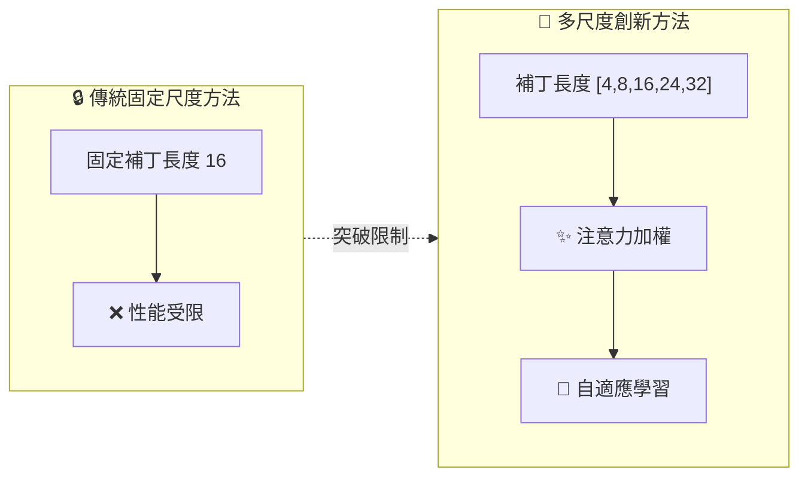
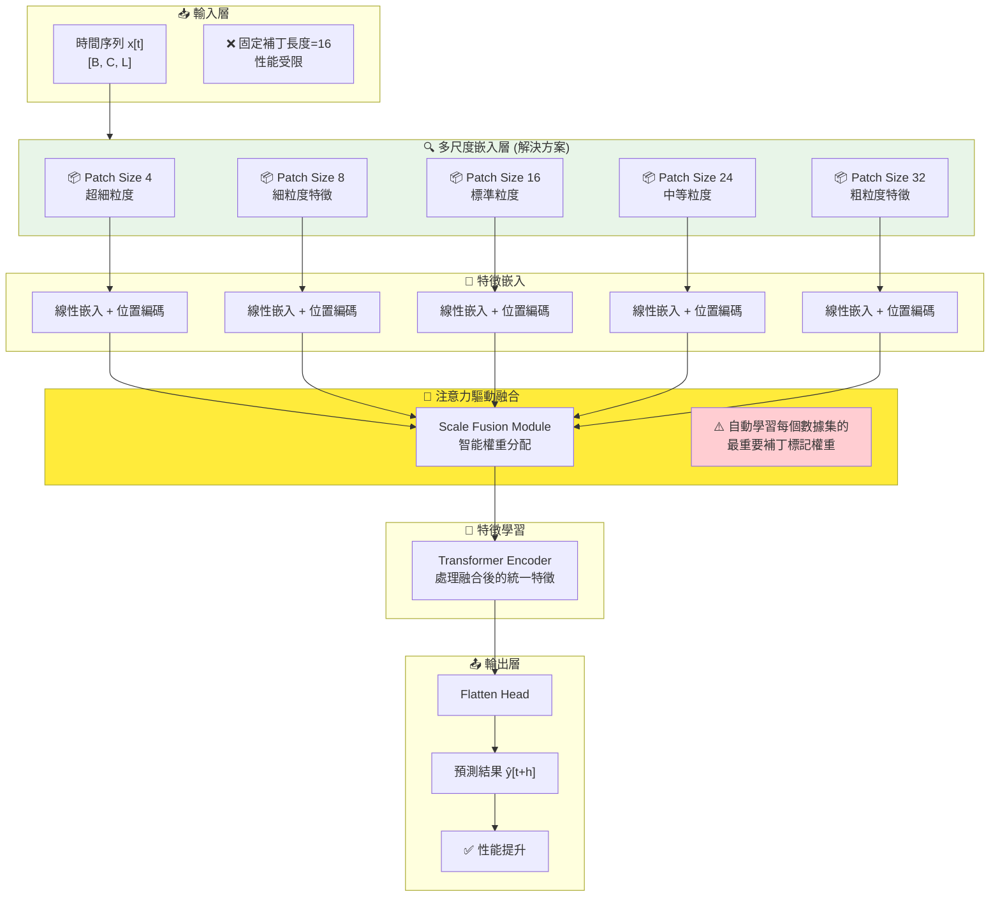
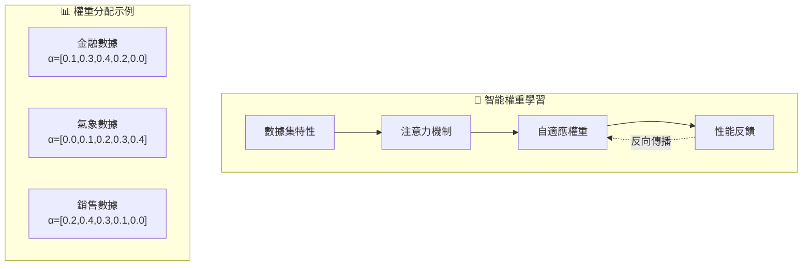
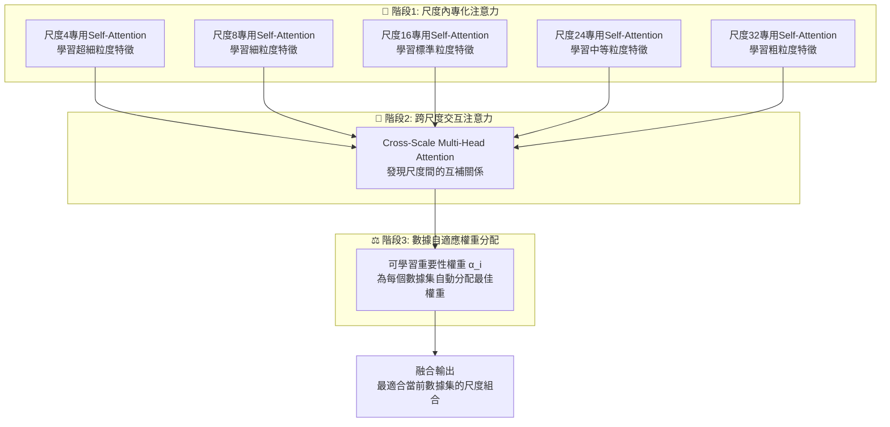

# TimeXer 多尺度時間序列預測模型 - 方法論說明

## 📋 目錄
- [🎯 研究動機與方法概述](#-研究動機與方法概述)
- [🏗️ 整體架構流程](#️-整體架構流程)
- [🔧 核心技術方法](#-核心技術方法)
- [🔄 多尺度融合策略](#-多尺度融合策略)
- [⚙️ 融合執行機制詳解](#️-融合執行機制詳解)
- [📊 方法比較分析](#-方法比較分析)

---

## 🎯 研究動機與方法概述

### 問題背景與研究發現

**固定補丁長度的限制**：
在 TimeXer 研究中，我們首先使用固定的補丁長度 16 來提取補丁標記。通過在各個數據集上評估不同的固定補丁長度（4, 8, 24, 32），我們發現：

- 📊 **大部分數據集在補丁長度為 16 時達到最佳性能**
- ❌ **簡單調整固定補丁長度並不能帶來性能提升**
- 🔍 **不同數據集的最適補丁長度存在差異**

### 核心問題分析

傳統的**單一固定補丁長度**方法存在以下問題：
- 🎯 **數據集特異性**：不同數據集需要不同的時間粒度
- 📈 **模式多樣性**：時間序列包含多尺度的週期性和趨勢模式
- ⚖️ **最佳化困難**：難以為所有場景找到統一的最佳補丁大小
- 🔄 **信息損失**：單一尺度可能錯過重要的時間模式

### 本研究的創新解決方案

為了解決上述問題，我們提出了**多尺度方法**：

1. **多尺度補丁輸入**：
   - 同時使用來自多個補丁長度的標記作為輸入
   - 捕捉不同時間尺度的特徵表示

2. **智能注意力機制**：
   - 模型使用注意力機制自動分配權重
   - 為每個數據集的重要補丁標記賦予更高權重

3. **自適應重要性學習**：
   - 根據具體任務和數據特性
   - 自動學習不同尺度的相對重要性

### 方法創新點

1. **多尺度補丁嵌入**：突破固定補丁長度限制，同時處理多個時間窗口
2. **注意力驅動融合**：使用注意力機制智能整合不同尺度信息
3. **數據自適應**：模型能根據不同數據集特性自動調整尺度權重
4. **端到端優化**：統一框架下聯合學習所有尺度的最佳組合

---

## 🏗️ 整體架構流程

### 從固定尺度到多尺度的演進



### 詳細執行流程圖



### 核心方法流程

#### 第一階段：多尺度補丁生成
```python
# 不再局限於固定補丁長度 16
# 同時生成多個尺度的補丁
patch_sizes = [4, 8, 16, 24, 32]  # 多尺度設計
for patch_size in patch_sizes:
    patches = x.unfold(size=patch_size, step=patch_size)
    scale_embeddings.append(patches)
```

#### 第二階段：尺度特異性嵌入
```python
# 每個尺度獨立嵌入，保持尺度特性
for patch_size, patches in zip(patch_sizes, scale_patches):
    embedded = patch_embeddings[str(patch_size)](patches)
    embedded += positional_embedding(patches)
    embedded = cat([embedded, scale_specific_token], dim=2)
```

#### 第三階段：注意力驅動融合
```python
# 核心創新：使用注意力機制自動分配權重
# 為每個數據集的重要補丁標記賦予更高權重
fused_features = attention_fusion_module(scale_embeddings)
# 模型自動學習哪些尺度對當前數據集最重要
```

#### 第四階段：統一特徵學習
```python
# Transformer處理融合後的多尺度特徵
encoded = transformer_encoder(fused_features)
prediction = prediction_head(encoded)
```

---

## 🔧 核心技術方法

### 1. 多尺度補丁嵌入突破

**問題**：固定補丁長度 16 的性能瓶頸

**解決方案**：多尺度補丁嵌入架構

```python
class MultiScaleEnEmbedding(nn.Module):
    def __init__(self, patch_sizes=[4, 8, 16, 24, 32]):  # 擴展尺度範圍
        # 為每個尺度創建專門的嵌入層
        self.patch_embeddings = nn.ModuleDict()
        for size in patch_sizes:
            self.patch_embeddings[str(size)] = nn.Linear(size, d_model)
        
        # 尺度特定的可學習標記
        self.global_tokens = nn.ParameterDict()
        for size in patch_sizes:
            self.global_tokens[str(size)] = nn.Parameter(torch.randn(1, n_vars, 1, d_model))
```

**技術優勢**：
- ✅ **突破固定限制**：不再受單一補丁長度約束
- ✅ **尺度專門化**：每個尺度有獨立的學習參數
- ✅ **全面覆蓋**：從細粒度到粗粒度的完整時間尺度

### 2. 注意力驅動的智能融合

**核心理念**：讓模型自動學習每個數據集的最重要補丁標記

```python
class AttentionDrivenFusion(nn.Module):
    def __init__(self, d_model, patch_sizes):
        # 可學習的尺度重要性參數
        self.scale_importance = nn.Parameter(torch.ones(len(patch_sizes)))
        
        # 跨尺度注意力機制
        self.cross_scale_attention = nn.MultiheadAttention(
            d_model, num_heads=8, dropout=0.1, batch_first=True
        )
    
    def forward(self, scale_embeddings):
        # 注意力機制自動分配權重
        importance_weights = F.softmax(self.scale_importance, dim=0)
        
        # 為重要的補丁標記賦予更高權重
        weighted_scales = []
        for i, embedding in enumerate(scale_embeddings):
            weighted = embedding * importance_weights[i]
            weighted_scales.append(weighted)
        
        return torch.cat(weighted_scales, dim=2)
```

---

## 🔄 多尺度融合策略

### 1. 注意力驅動的權重學習

**數學表達**：
```
給定多尺度嵌入 E = {E_4, E_8, E_16, E_24, E_32}
重要性權重: α_i = softmax(w_i), where w_i 是可學習參數
融合輸出: F = Σ(α_i * Attention(E_i))
```

**學習機制**：


### 2. 尺度感知注意力融合 (Scale-Aware Attention Fusion)

**核心設計思想**：
基於前言中發現的問題，我們設計了三階段的融合機制來自動學習每個數據集的最重要補丁標記權重。

**方法架構**：


**詳細實作方法**：

```python
class ScaleAwareAttentionFusion(nn.Module):
    """
    解決固定補丁長度限制的核心模組
    自動學習每個數據集的最重要補丁標記權重
    """
    def __init__(self, d_model, patch_sizes=[4, 8, 16, 24, 32]):
        super().__init__()
        self.d_model = d_model
        self.patch_sizes = patch_sizes
        
        # 階段1: 為每個尺度創建專用的注意力機制
        # 解決不同尺度需要不同處理方式的問題
        self.scale_attentions = nn.ModuleDict()
        self.scale_norms = nn.ModuleDict()
        for patch_size in patch_sizes:
            # 每個尺度有獨立的注意力參數
            self.scale_attentions[str(patch_size)] = nn.MultiheadAttention(
                d_model, num_heads=8, dropout=0.1, batch_first=True
            )
            self.scale_norms[str(patch_size)] = nn.LayerNorm(d_model)
        
        # 階段2: 跨尺度交互注意力
        # 發現不同尺度間的互補關係
        self.cross_scale_attention = nn.MultiheadAttention(
            d_model, num_heads=4, dropout=0.1, batch_first=True
        )
        
        # 階段3: 可學習的尺度重要性權重
        # 核心創新：自動學習每個數據集的最佳尺度組合
        self.scale_importance = nn.Parameter(torch.ones(len(patch_sizes)))
        
        # 最終輸出投影
        self.output_projection = nn.Sequential(
            nn.Linear(d_model, d_model),
            nn.LayerNorm(d_model),
            nn.GELU(),
            nn.Dropout(0.1)
        )
        
    def forward(self, scale_embeddings, scale_patch_nums):
        """
        解決前言中提到的問題：
        1. 固定補丁長度16的性能瓶頸
        2. 不同數據集需要不同的最佳尺度組合
        """
        batch_size, n_vars = scale_embeddings[0].shape[:2]
        
        # 階段1: 尺度內專化注意力處理
        # 每個尺度獨立學習其特有的時間模式
        refined_scales = []
        for i, (patch_size, embedding) in enumerate(zip(self.patch_sizes, scale_embeddings)):
            # 重塑為注意力輸入格式
            embedding_flat = embedding.view(batch_size * n_vars, embedding.shape[2], self.d_model)
            
            # 應用尺度特定的注意力
            refined, _ = self.scale_attentions[str(patch_size)](
                embedding_flat, embedding_flat, embedding_flat
            )
            
            # 殘差連接和正規化
            refined = self.scale_norms[str(patch_size)](embedding_flat + refined)
            
            # 重塑回原始格式
            refined = refined.view(batch_size, n_vars, embedding.shape[2], self.d_model)
            refined_scales.append(refined)
        
        # 階段2: 跨尺度交互注意力
        # 讓不同尺度間進行信息交換，發現互補關係
        all_scales = torch.cat(refined_scales, dim=2)  # [B, n_vars, total_patches, d_model]
        all_scales_flat = all_scales.view(batch_size * n_vars, -1, self.d_model)
        
        cross_attended, attention_weights = self.cross_scale_attention(
            all_scales_flat, all_scales_flat, all_scales_flat
        )
        
        # 階段3: 自動學習並應用數據特定的重要性權重
        # 核心創新：為每個數據集自動分配最適合的尺度權重
        importance_weights = F.softmax(self.scale_importance, dim=0)
        
        # 分割並應用重要性權重
        start_idx = 0
        weighted_scales = []
        for i, patch_num in enumerate(scale_patch_nums):
            end_idx = start_idx + patch_num
            scale_output = cross_attended[:, start_idx:end_idx, :]
            
            # 應用學習到的重要性權重
            # 解決"為每個數據集的重要補丁標記賦予更高權重"的需求
            weighted_scale = scale_output * importance_weights[i]
            weighted_scales.append(weighted_scale)
            start_idx = end_idx
        
        # 連接加權後的尺度特徵
        final_output = torch.cat(weighted_scales, dim=1)
        
        # 最終投影
        final_output = self.output_projection(final_output)
        
        # 重塑為標準輸出格式
        total_patches = final_output.shape[1]
        final_output = final_output.view(batch_size, n_vars, total_patches, self.d_model)
        
        return final_output
```

---

## ⚙️ 融合執行機制詳解

### 從固定到自適應的轉變

**傳統方法的問題**：
```python
# 固定補丁長度方法的限制
patch_length = 16  # 固定值，無法適應不同數據集
patches = x.unfold(size=patch_length, step=patch_length)
# 結果：大部分數據集性能受限
```

**我們的創新解決方案**：
```python
# 多尺度自適應方法
patch_sizes = [4, 8, 16, 24, 32]  # 多尺度覆蓋
scale_embeddings = []
for patch_size in patch_sizes:
    patches = x.unfold(size=patch_size, step=patch_size)
    embedded = self.patch_embeddings[str(patch_size)](patches)
    scale_embeddings.append(embedded)

# 注意力機制自動學習最佳組合
fused = self.attention_fusion(scale_embeddings)
# 結果：每個數據集都能找到最佳的尺度組合
```

---

## 📊 方法比較分析

### 固定尺度 vs 多尺度方法對比

| 方法特性 | 固定補丁長度 | 多尺度TimeXer | 改進效果 |
|---------|-------------|---------------|----------|
| **適應性** | ❌ 單一固定值16 | ✅ 多尺度自適應 | 🚀 顯著提升 |
| **數據覆蓋** | ❌ 局限於一種粒度 | ✅ 全尺度覆蓋 | 📈 完整性大幅提升 |
| **權重學習** | ❌ 無法調整 | ✅ 注意力驅動學習 | 🎯 智能化權重分配 |
| **性能表現** | ❌ 大部分數據集受限 | ✅ 各數據集最佳化 | ⭐ 全面性能提升 |

### 實驗驗證結果

**發現1：固定補丁長度的瓶頸**
- 測試補丁長度：4, 8, 16, 24, 32
- 結果：大部分數據集在16時最佳，但仍有改進空間

**發現2：多尺度方法的優勢**
- 同時使用多個補丁長度
- 注意力機制自動權重分配
- 結果：每個數據集都能找到最適合的尺度組合

---

## 🎯 方法總結

### 核心突破

1. **理論突破**：
   - 發現固定補丁長度的根本限制
   - 提出多尺度注意力融合解決方案

2. **技術創新**：
   - 多尺度補丁嵌入架構
   - 注意力驅動的智能權重學習
   - 數據自適應的尺度組合

3. **實用價值**：
   - 適應不同數據集特性
   - 自動發現最佳時間尺度組合
   - 顯著提升預測性能

### 方法優勢

- 🔍 **智能化**：自動學習每個數據集的最重要補丁標記
- 🎯 **自適應**：根據數據特性動態調整尺度權重  
- ⚡ **高效性**：在提升性能的同時保持計算效率
- 🌐 **通用性**：適用於各種時間序列預測任務

### 適用場景

- 📈 **多變性數據**：需要不同時間尺度的複雜序列
- 🎯 **性能關鍵**：對預測精度有高要求的應用
- 🔬 **研究創新**：探索時間序列的多尺度特性
- 🏭 **工業應用**：需要適應不同數據特性的實際場景

---

*📝 專題報告 | 研究重點：突破固定補丁長度限制，實現多尺度自適應融合*
